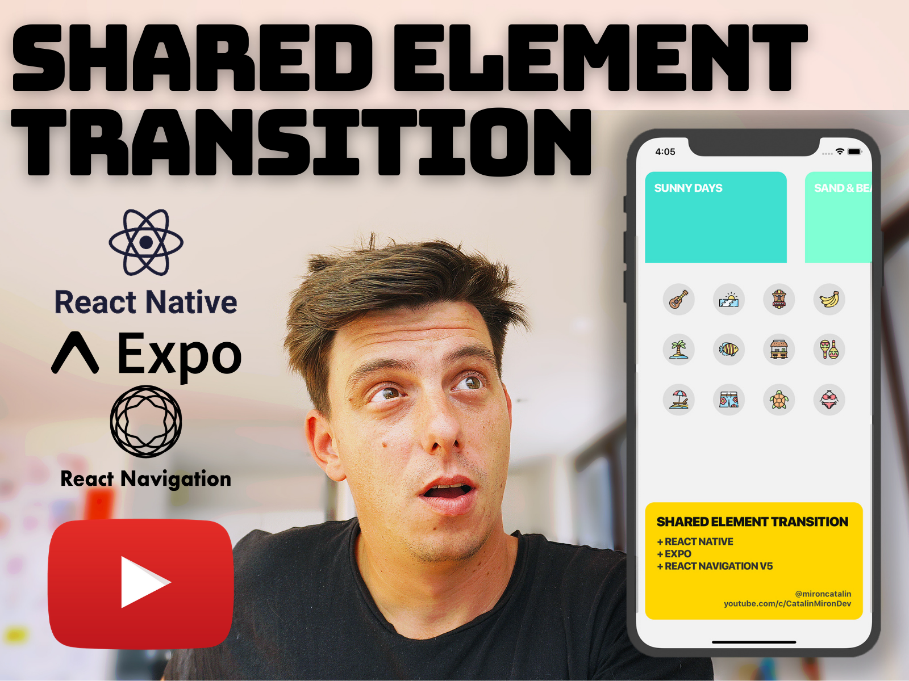

# React Native Shared Element transitions

<a href="https://www.buymeacoffee.com/catalinmiron" target="_blank"></a>

[**Join Discord**](https://discord.gg/vg7hUDU)

## Previews

### Tutorial #1

https://user-images.githubusercontent.com/2805320/226144577-e7c48972-cbaa-4dcb-98ed-ca07db3144a4.mp4

### Tutorial #2

https://user-images.githubusercontent.com/2805320/226144578-5e1d7291-8a3c-414c-8eb3-d4e34c4774f5.mp4

### Tutorial #3

https://user-images.githubusercontent.com/2805320/226144583-10749358-934c-43ce-ae60-d934903bc580.mp4

### Tutorial #4

https://user-images.githubusercontent.com/2805320/226144584-9675a364-518c-42ca-acce-22a3b7052ebf.mp4

### Tutorial #5

https://user-images.githubusercontent.com/2805320/226144586-897fe96f-96bb-4b57-9ce1-98fe089de218.mp4

### Tutorial #6

https://user-images.githubusercontent.com/2805320/226144588-566c2153-87e6-4a76-8444-9d05b0869ec9.mp4

### Tutorial #7

https://user-images.githubusercontent.com/2805320/226144589-e54e6f6a-e79b-47ab-8049-4a51af2b4a96.mp4

### Tutorial #8

https://user-images.githubusercontent.com/2805320/226144590-38bf7e5c-a5cf-415b-a561-375d42c0fabb.mp4

### Tutorial #9

https://user-images.githubusercontent.com/2805320/226144591-180e6cba-8ae3-419f-a485-aaa0401515c3.mp4

### Tutorial #10

https://user-images.githubusercontent.com/2805320/226144592-4eb7e89e-077e-4861-8002-c23039a77453.mp4

### Tutorial #11

https://user-images.githubusercontent.com/2805320/226144593-089c46df-8dce-470f-bdc4-ac157b8d6469.mp4

---

### Youtube tutorials links

[](https://youtu.be/C2Q_MPxqLMI)

- Icons from: https://www.flaticon.com/packs/tropical-destination-1
- Inspiration: https://dribbble.com/shots/3435714-Salon-category-discovery-exploration

---

- GitHub: https://github.com/catalinmiron/react-native-shared-element-transitions
- Expo: https://expo.io/

You can find me on:

- Github: http://github.com/catalinmiron
- Twitter: http://twitter.com/mironcatalin

Wanna give me a coffe?

- Paypal: mironcatalin@gmail.com

In this video tutorial we'll learn how to create an accordion animation in React Native using Transition API from React Native Reanimated library (https://github.com/software-mansion/react-native-reanimated) and flexbox styling.
We will re-create an awesome and colourful animation done by InterfaceMarket.

Inspiration: https://interfacemarket.com/ui-kits/boston-grocery-delivery-app-ui-kit
GitHub: https://github.com/catalinmiron/react-native-accordion-menu
Reanimated: https://github.com/software-mansion/react-native-reanimated

---

Video tutorials timeline:

```
Here's what I'll build in the upcoming days (the shared element transition + other animations/carousel):

Tutorial #1 https://dribbble.com/shots/3435714-Salon-category-discovery-exploration
Tutorial #2 https://dribbble.com/shots/7378780-Travel-App-Trip-Detail-Animation
Tutorial #3 https://dribbble.com/shots/8212928-TravelUP-Animation
Tutorial #4 https://dribbble.com/shots/5529409-Photography-Motion
Tutorial #5 https://dribbble.com/shots/14012443-Volkswagen-App-Concept-Models
Tutorial #6 https://dribbble.com/shots/3894781-Urbanears-Headphones
Tutorial #7 https://dribbble.com/shots/7594892-Food-display-animation
Tutorial #8 https://dribbble.com/shots/7133681-Mobile-App-Beauty-Services
Tutorial #9 https://dribbble.com/shots/3731362-Event-cards-iOS-interaction
Tutorial #10 https://dribbble.com/shots/8257559-Movie-2-0
Tutorial #11 https://dribbble.com/shots/9323126-Bank-cards-3-0
```
